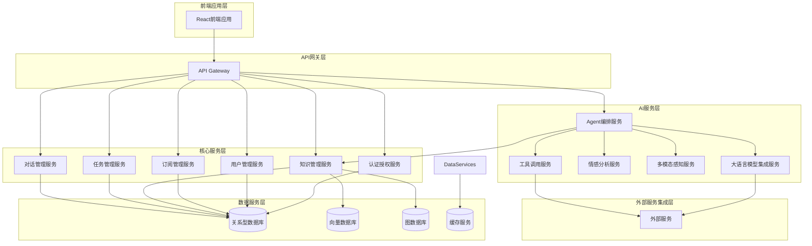

# xdream-agent 产品文档

## 1. 产品概述

xdream-agent 是一款创新的AI聊天问题解答智能体，致力于解决用户在AI聊天工具中遇到的情感理解、复杂问题解决、对话连贯性和信息检索效率等方面的痛点。

通过整合先进的大语言模型、多模态感知、知识图谱等技术，xdream-agent旨在提供一个功能强大、智能高效、用户友好的AI交互平台，赋能个人和团队更高效地利用AI技术解决实际问题。

## 2. 核心功能

### 2.1 智能问答与知识库集成
- **多源信息整合**：集成互联网、用户自定义知识库、历史对话记录等多种信息来源
- **实时信息更新**：具备联网能力，获取最新信息
- **专业领域知识深度**：支持用户导入专业知识，学习用户行为，提供深度解答

### 2.2 高级对话管理
- **上下文感知与记忆**：保持对话上下文，提供连贯一致的响应
- **主动澄清与追问**：对于模糊问题主动进行澄清，提高回答准确性
- **情感识别与响应**：识别用户情绪，提供相应的情感支持和个性化回应

### 2.3 个性化与用户画像
- **用户偏好学习**：学习用户行为模式和偏好，提供个性化服务
- **个性化推荐**：基于用户兴趣和历史行为提供智能推荐
- **角色扮演与风格定制**：支持不同角色设定和回答风格定制

### 2.4 高效信息管理与协作
- **全局检索与历史记录**：提供全局搜索功能，方便查找历史对话和知识
- **知识沉淀与分享**：自动从对话中提取知识，支持知识图谱构建和知识分享
- **任务管理与提醒**：集成任务管理功能，支持创建任务、设置提醒

### 2.5 "问题终结者"的Agent工作流
- **多Agent协作模式**：设计Agent调度和协作框架，实现复杂任务分解与协作
- **工具调用与自动化**：实现外部工具（代码解释器、数据分析工具、文档生成器、浏览器等）的集成和调用
- **可解释性与透明度**：记录并展示Agent的思考路径和工具调用过程

## 3. 系统架构

xdream-agent 采用微服务架构，确保系统的模块化、可扩展性和高可用性。整体架构分为以下几层：

### 3.1 系统架构图

### 3.2 各层职责

#### 3.2.1 前端应用层 (Frontend Application Layer)
- **技术栈**：React 18+ + TypeScript + Tailwind CSS
- **职责**：提供用户界面，处理用户交互，通过API网关与后端服务通信

#### 3.2.2 API 网关层 (API Gateway Layer)
- **技术栈**：Spring Cloud Gateway
- **职责**：统一入口，负责请求路由、负载均衡、认证授权、限流熔断等

#### 3.2.3 核心服务层 (Core Services Layer)
- **技术栈**：Java Spring Boot 3.x + Java 17+ + Gradle
- **职责**：提供基础业务功能支持
  - **认证授权服务 (AuthService)**：用户注册、登录、会话管理、权限控制
  - **用户管理服务 (UserService)**：用户资料、偏好设置、用户画像管理
  - **订阅管理服务 (SubscriptionService)**：处理用户订阅、付费、套餐管理
  - **知识管理服务 (KnowledgeService)**：知识的创建、存储、检索、分享、权限控制
  - **任务管理服务 (TaskService)**：任务的创建、分配、状态更新、提醒
  - **对话管理服务 (ChatService)**：对话会话管理、消息存储与检索

#### 3.2.4 AI 服务层 (AI Services Layer)
- **技术栈**：Java Spring Boot 3.x + Java 17+ + Gradle
- **职责**：提供AI核心能力支持
  - **Agent 编排服务 (AgentOrchestrationService)**：根据用户意图，调度内部Agent和外部工具，管理Agent工作流
  - **大语言模型集成服务 (LLMIntegrationService/LLM Service)**：封装对各类大语言模型（如OpenAI GPT, DeepSeek-V3）的调用，提供统一接口
  - **情感分析服务 (EmotionAnalysisService)**：识别用户输入中的情感，为Agent提供情感上下文
  - **多模态感知服务 (MultimodalPerceptionService)**：处理文本、语音、图像等多模态输入，将其转化为Agent可理解的格式
  - **工具调用服务 (ToolCallingService)**：管理和执行外部工具的调用

#### 3.2.5 数据服务层 (Data Services Layer)
- **技术栈**：H2 (开发环境), PostgreSQL (生产环境), Redis, 向量数据库, 图数据库
- **职责**：提供数据存储和检索支持

#### 3.2.6 外部服务集成层 (External Services Integration Layer)
- **职责**：集成第三方服务，如大语言模型API、互联网搜索API、代码解释器等

## 4. 技术栈选择

### 4.1 前端技术栈
- **框架**：React 18+
- **语言**：TypeScript
- **状态管理**：Zustand / React Query
- **UI 组件库**：Ant Design / Material-UI / Shadcn UI
- **样式**：Tailwind CSS
- **路由**：React Router DOM
- **构建工具**：Vite
- **HTTP 客户端**：Axios / Fetch API

### 4.2 后端技术栈
- **框架**：Spring Boot 3.x
- **语言**：Java 17+
- **构建工具**：Gradle
- **Web 框架**：Spring WebFlux (响应式编程) 或 Spring MVC
- **数据访问**：Spring Data JPA / MyBatis
- **数据库**：H2 (开发/测试), PostgreSQL (生产)
- **缓存**：Spring Cache + Redis
- **消息队列**：Kafka / RabbitMQ
- **认证授权**：Spring Security + JWT
- **API 文档**：Springdoc OpenAPI (Swagger UI)
- **监控**：Spring Boot Actuator + Prometheus + Grafana
- **日志**：SLF4J + Logback

## 5. 核心功能模块详解

### 5.1 LLM集成服务 (LLM Service)

LLM服务是xdream-agent的核心服务之一，负责集成和管理各种大语言模型，为整个系统提供AI能力支持。

#### 5.1.1 支持的模型
- DeepSeek-V3 (通过SiliconFlow API)
- GPT-4
- Text Embedding Ada 002 (文本嵌入模型)
- Qwen Image Edit (图片编辑模型)

#### 5.1.2 核心功能
- 非流式对话生成
- 流式对话生成
- 文本嵌入
- 图像生成与编辑
- 模型切换与负载均衡
- 模拟回复（用于降级处理）

#### 5.1.3 ReAct Agent支持
LLM服务集成了ReAct（推理+行动）Agent模式，能够通过思考-行动-观察的循环来解决复杂问题，提高回答的准确性和可靠性。

### 5.2 知识管理服务

知识管理服务负责管理用户的知识库，支持知识的创建、存储、检索、更新和删除，并与向量数据库和图数据库集成，实现高效的知识检索和知识图谱构建。

### 5.3 对话管理服务

对话管理服务负责管理用户的对话会话，包括创建对话、存储和检索消息、维护对话上下文等，并通过WebSocket实现实时消息通信。

### 5.4 Agent编排服务

Agent编排服务是xdream-agent的"大脑"，负责解析用户意图，调度不同的内部Agent和外部工具，管理Agent工作流，生成最终的响应结果。

## 6. 用户界面设计

前端应用将采用现代化的UI设计，提供直观、易用的用户界面。主要模块包括：

### 6.1 认证模块
- 用户注册、登录、登出、密码找回

### 6.2 主页/对话模块
- 历史对话列表、创建新对话、实时聊天界面、消息发送/接收、Agent切换、工具调用结果展示

### 6.3 知识库模块
- 知识条目列表、搜索、筛选、创建、编辑、删除、文件上传、知识图谱可视化

### 6.4 任务管理模块
- 任务列表、创建、编辑、状态更新、提醒设置

### 6.5 个人设置/账户管理模块
- 个人资料编辑、偏好设置、订阅管理、API Key管理

## 7. 关键技术亮点

### 7.1 多模态感知
支持处理文本、语音、图像等多模态输入，提供更丰富的交互体验。

### 7.2 检索增强生成 (RAG)
通过向量数据库和知识管理服务，实现基于检索增强的生成，确保AI回答的知识性和时效性。

### 7.3 多Agent协作
设计灵活的Agent调度框架，支持多个Agent协同工作，解决复杂问题。

### 7.4 工具调用能力
支持调用各种外部工具，如代码解释器、数据分析工具、文档生成器等，扩展AI的能力边界。

### 7.5 情感分析
能够识别用户情绪，提供相应的情感支持和个性化回应，提升用户体验。

### 7.6 知识图谱
自动从对话和文档中提取信息，构建知识图谱，支持复杂知识关联和推理。

## 8. 应用场景

### 8.1 个人助手
作为个人AI助手，帮助用户处理日常任务、回答问题、提供建议。

### 8.2 学习辅助
提供学习资料检索、概念解释、习题解答等功能，辅助用户学习。

### 8.3 知识管理
帮助用户整理、存储、检索和分享知识，构建个人或团队知识库。

### 8.4 工作效率提升
辅助用户进行文档撰写、数据分析、代码编写等工作，提高工作效率。

### 8.5 创意生成
帮助用户生成创意、灵感、故事等内容，激发创造力。

## 9. 总结

xdream-agent 是一款功能强大、架构先进的AI聊天问题解答智能体，通过整合多种前沿技术，为用户提供智能、高效、个性化的AI服务体验。其模块化的微服务架构设计，确保了系统的可扩展性、高可用性和性能，能够满足不同用户的需求场景。

通过持续优化和创新，xdream-agent将不断提升其AI能力和用户体验，成为用户日常工作、学习和生活中的得力助手。